<p align="center">
  <a href="https://kodela.com">
    
  </a>
</p>

<h1 align="center">Kodela</h1>

<p align="center">
  <strong>Permanent memory for AI-assisted development.</strong><br>
  Kodela captures the <em>why</em> behind every code change — especially the AI-generated ones —
  and turns it into a queryable memory graph for your team and your agents.
</p>

<p align="center">
  <a href="https://www.npmjs.com/package/@kodela/cli"></a>
  <a href="LICENSE"></a>
  = 24">
  
  <a href="https://github.com/tkarlmarx/kodela-oss"></a>
</p>

<p align="center">
  <a href="https://kodela.com"><b>Website</b></a> ·
  <a href="https://kodela.com/docs"><b>Docs</b></a> ·
  <a href="https://kodela.com/platform"><b>Platform</b></a> ·
  <a href="https://github.com/tkarlmarx/kodela-oss/issues"><b>Issues</b></a>
</p>

---

Git records *what* changed. Kodela records ***why*** — the reasoning, the author
(you or which AI tool), the alternatives rejected, and whether it's still
correct — and keeps it next to the code, structured and queryable, **fully on
your machine**.

```console
$ kodela context src/auth/jwt.ts

→ Last modified by Claude Code on 2026-03-15 (session e3f9c)
→ Why: fix token-expiry bug causing 3-minute session drops
→ Decision: ed25519 over RSA — performance, reviewed by @hari
→ Risk: medium (auth path) — signed off 2026-03-16
```

> Free, local-first **Community Edition** (Apache-2.0) — no account, no cloud.
> Team, Cloud, and Enterprise editions add the web dashboard, shared team
> memory, governance, and hosted deployment.

## Quick start

One line wires Kodela into every AI tool it detects (Claude Code, Cursor, VS
Code, Windsurf…), generates your Memory Bank, and starts capturing — no account,
nothing leaves your machine:

```bash
npx -y @kodela/cli connect --apply --npx
```

Then browse everything Kodela has captured in a free local web app:

```bash
npx -y @kodela/cli ui     # → http://localhost:7420
```

Requires Node 24+.

## See it in action

`kodela ui` is a free, local, read-only web app over everything Kodela has
captured — search the *why*, browse human-authored decisions, and explore a
**radial memory map** that links every file to the decision it implements. No
account, nothing leaves your machine.

<p align="center">
  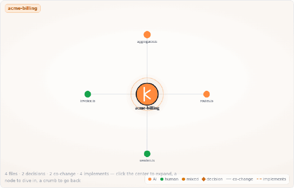
</p>

<p align="center"><i>The radial memory map — the project at the centre, its files on a ring, and the <b>decision each file implements</b> one click away. Click to dive in, the breadcrumb to climb out.</i></p>

### Trace a function to the decision behind it

Click a file to make it the centre; the files it co-changes with (grey spokes)
and the **decisions it implements** (copper diamonds, dashed spokes) fan out
around it — so you see the *why*, not just what moved together. The side panel
shows the captured reasoning for every function in that file.

<p align="center">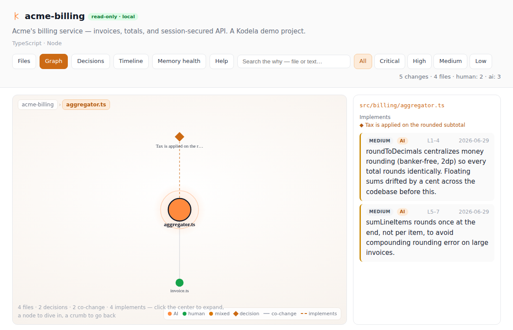</p>

### Search the why

Every change carries who made it (you or which AI tool), the problem it solved,
the reasoning, the line range, and a risk rating — structured, not free-text
notes. **Copy why for PR** drops a Markdown summary onto your clipboard.

<p align="center">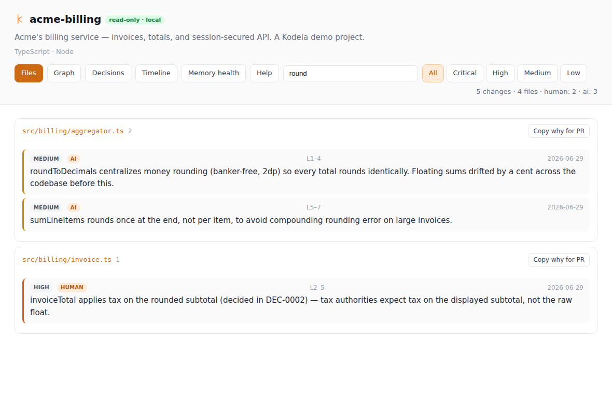</p>

### Read the decisions

Human-authored decision records — the problem, the decision, the reasoning, the
options considered (chosen vs. rejected, with the rejection reason), and the
outcome once it lands.

<p align="center">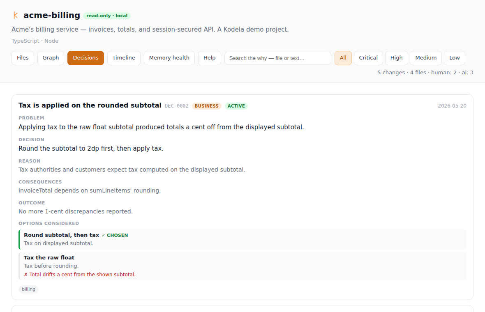</p>

### Watch your agent get smarter

Memory-health metrics: how much context you've captured, captures per session
and the trend, and how often a session reuses prior memory.

<p align="center">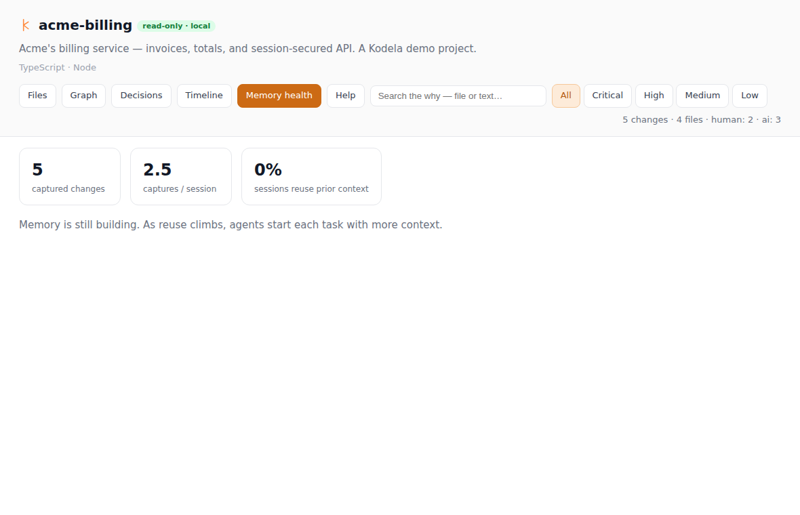</p>

## Understand any codebase — structure *fused with the why*

Other tools can draw your repo's structure. Kodela draws it **and hangs the
recorded reasons on it** — the decision, the risk, the why. Every command below
runs **offline in the CLI (no API key)**, so it's all in the community edition —
and renders visually in `kodela ui` too.

**Ask your memory in plain language.** Retrieval is **reranked on-device** (a
field-aware blend of similarity + exact-phrase + recency + decision weight), and
every result shows *why* it ranked where it did — not a black box.

<p align="center">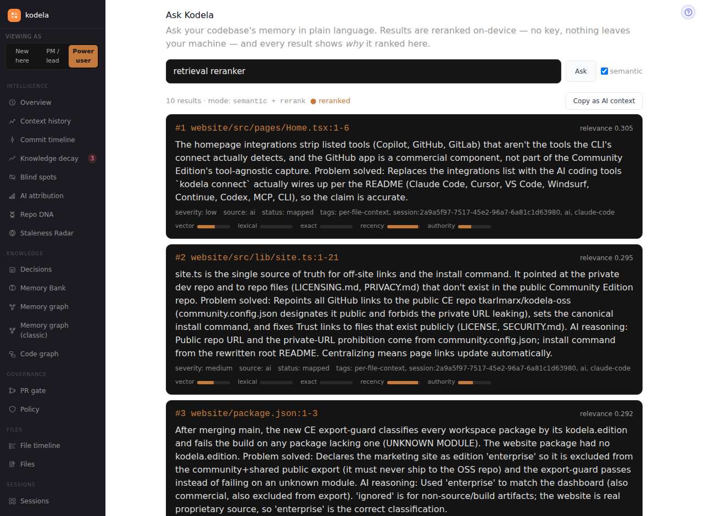</p>

- **`kodela comprehend`** — a file → class → function map, each node fused with the captured why and the decision that shaped it.
- **`kodela tour`** — a dependency-ordered onboarding walkthrough; localize it with `--language`.
- **`kodela impact [files…]`** — a change's blast radius on *both* axes: what transitively imports it **and** the decisions/risk in that radius. `--ci --fail-on high` makes it a gate.
- **`kodela architecture`** — auto-derived technical layers + business domains + the cross-layer dependency matrix, with the risk each layer carries.
- **`kodela recall [topic]`** — the most relevant prior why as a paste-ready block; no topic → auto-recall for the current task.
- **`kodela hygiene`** — a memory-health score plus the orphaned / drifted / stale / overlapping entries to reconcile.

<p align="center">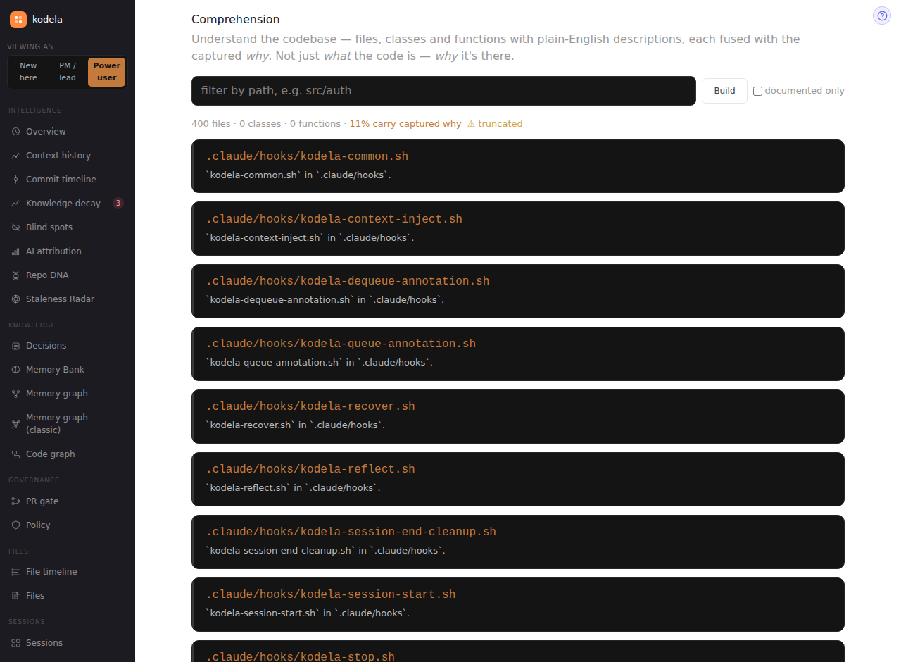</p>

<p align="center">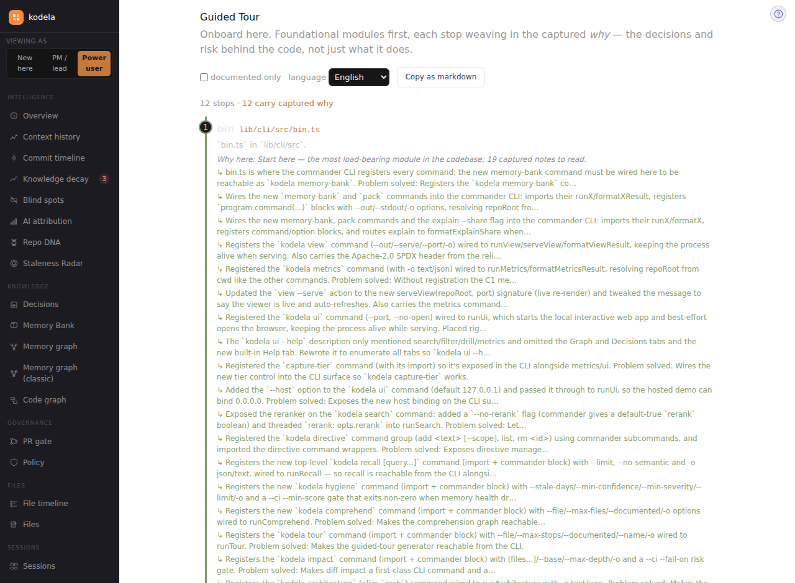</p>

<p align="center">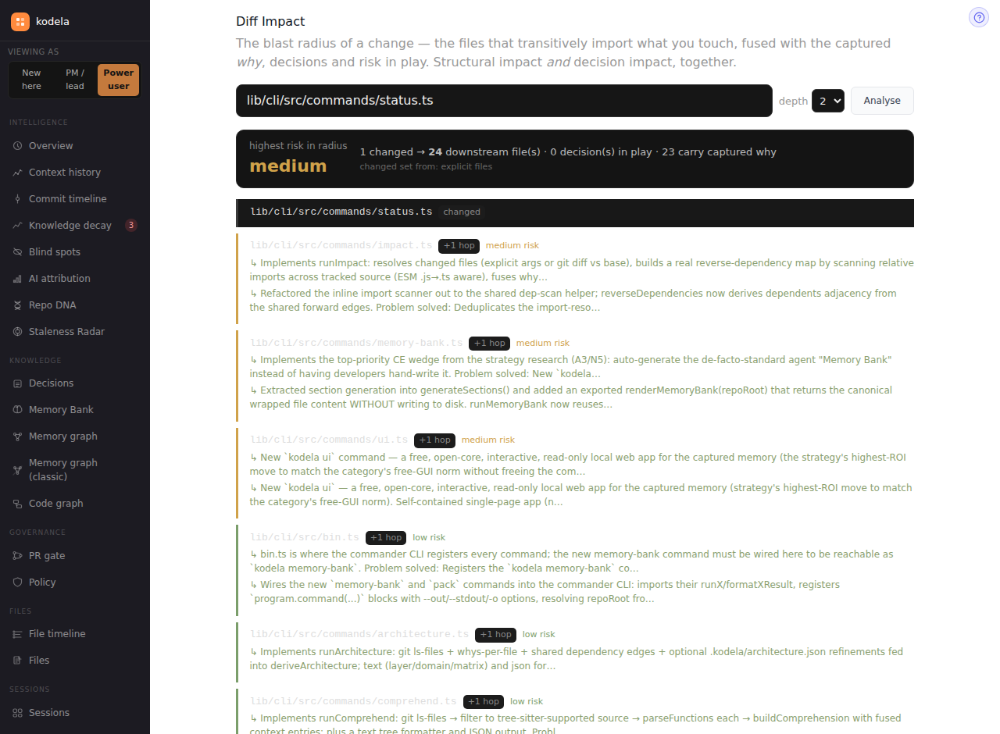</p>

<p align="center">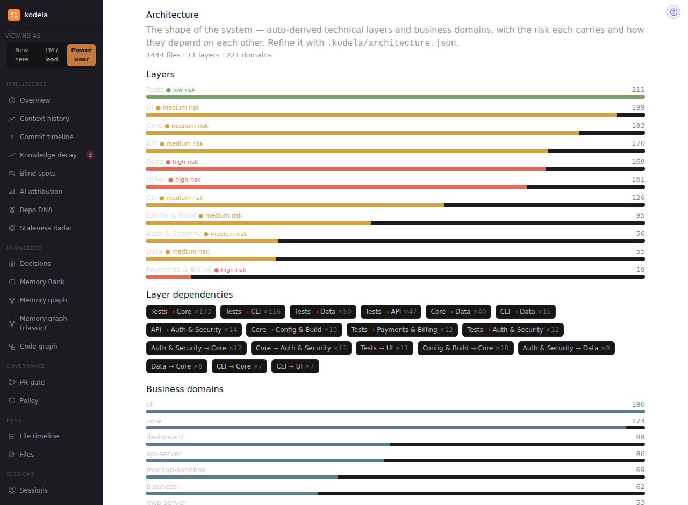</p>

## Features

- 🧠 **Structured capture** — actor (human or which AI tool), the problem solved, the reasoning, rejected alternatives, and a risk rating — not free-text notes.
- 🔌 **Two-path capture** — an **MCP** fast path for MCP-capable agents, plus a **silent watcher** that records git + filesystem as ground truth so context is never lost.
- 🕸️ **Fused memory graph** — the code-structure graph (tree-sitter AST) fused with the decision/session graph. Trace a function → the session that wrote it → the decision it implements → the PR or incident behind it.
- 🖥️ **Free local app** (`kodela ui`) — search the why, an interactive graph, human-authored decisions, a timeline, and memory-health metrics. Read-only, local-only.
- 🎚️ **Capture tiers** — `enforced` (every change explained), `assisted`, or `ambient` (install, keep working, fill in asynchronously).
- 🔍 **Offline semantic search**, a one-file repo+why **pack** for any model, a **Memory Bank** agents read at task start, and a **VS Code** extension.

## How it works

```
        MCP-capable agents                 everything else
     (Claude Code, Cursor…)         (browser agents, raw git commits)
              │                                   │
       MCP fast path                       silent watcher
       (kodela_annotate_file)              (git + filesystem)
              └───────────────┬───────────────────┘
                              ▼
                    one local memory (.kodela/)
              SQLite + JSON · fused code↔decision graph
                              ▼
                 humans  ·  AI agents  ·  kodela ui
```

A session can't close until every changed file is explained, checked against a
git-diff baseline — so the memory stays complete, not best-effort.

## Team & Enterprise edition — the shared dashboard

The free **Community Edition** above is single-user and local. **Team, Cloud,
and Enterprise** editions add a multi-tenant web **dashboard** over the same
captured memory — shared team knowledge, governance, and org administration.
Here's a walkthrough of every view:

<p align="center">
  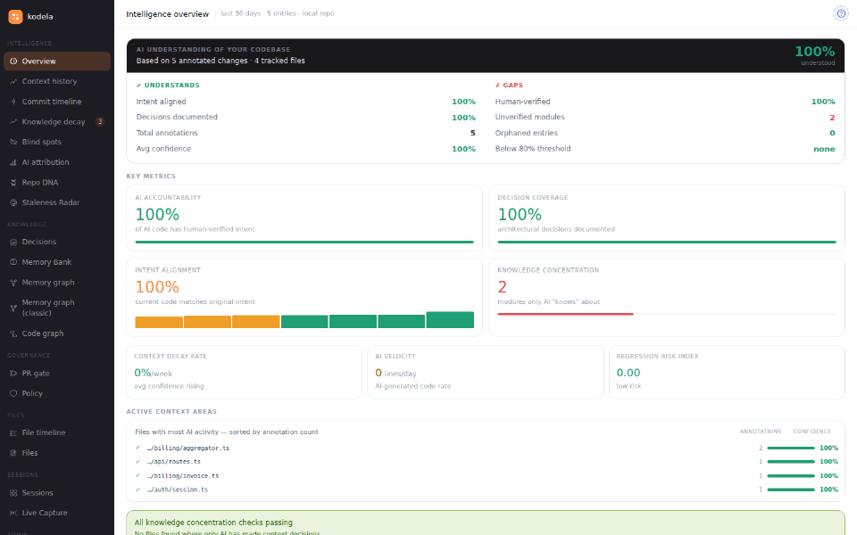
</p>

**🧠 Intelligence** — how well your codebase is understood, and where it isn't:
- **Overview** — an AI-understanding scorecard: intent-aligned %, decision coverage, knowledge concentration, decay rate, regression-risk index.
- **Context history** · **Commit timeline** — how the *why* accumulated over time.
- **Knowledge decay** · **Staleness Radar** — annotations drifting out of date with the code.
- **Blind spots** — files AI changed with no captured reasoning.
- **AI attribution** — which tool (Claude Code, Cursor, …) authored what, and how much is human-verified.
- **Repo DNA** — the project's conventions, stack, and decided-against list.

**📚 Knowledge** — the fused memory graph:
- **Decisions** — human-authored decision records (problem → decision → options → outcome).
- **Memory graph** · **Code graph** — the code-structure graph fused with the decision/session graph.
- **Function context** — trace a function → the session that wrote it → the decision it implements → the PR/incident behind it.
- **Memory Bank** — the 6-file brief agents read at the start of every task.

**🗂️ Files & Sessions** — **Files**, **File timeline**, **Sessions**, **Capture debug**, and **Live Capture** (watch context land in real time).

**🛡️ Governance** — **PR gate** (block un-explained AI changes), **Policy** (per-path rules: min confidence, required review, allowed AI tools), **Audit log** (exportable, every context mutation), and an **Executive view** (org-wide risk & compliance trends for CTO/CISO review).

**⚙️ Admin** — **Users & seats**, **Roles & RBAC**, **SSO**, **API tokens**, **Repositories** & **Repo access**, **Webhooks**, **Usage & quota**, **Security**, **Data & retention**, **Organization**, and **License & billing** (self-serve upgrade).

<table>
<tr>
<td width="50%" valign="top"></td>
<td width="50%" valign="top">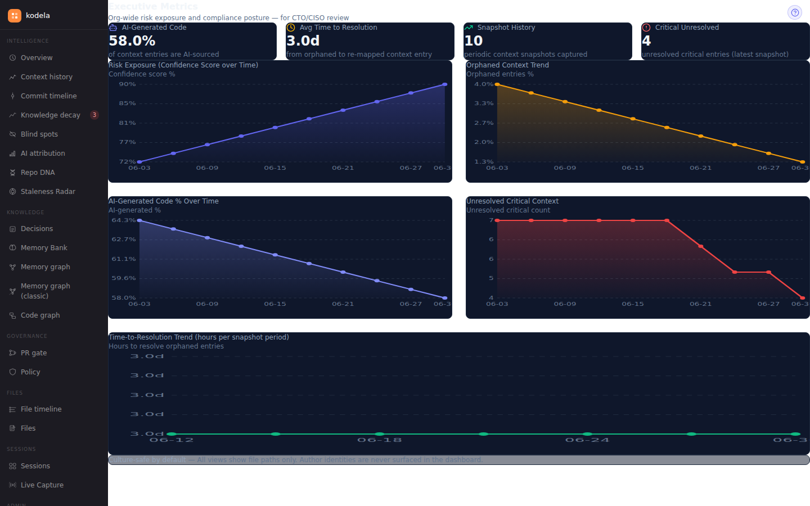</td>
</tr>
</table>

> The dashboard is the commercial layer; the capture engine, CLI, MCP server,
> watcher, and `kodela ui` are open source and free forever. See
> [kodela.com/pricing](https://kodela.com/pricing).

## Kodela vs. general AI-memory frameworks

|  | **Kodela** | General AI-memory (e.g. Cognee, Mem0) |
|---|---|---|
| What it remembers | The **why** of code changes — decisions, risk, actor | Conversations & facts as embeddings |
| Code-aware | ✅ Fuses AST + imports with the reasoning | ❌ Not aware of code structure |
| Where it runs | **Local-first**, offline by default | Usually cloud / vector DB |
| Relationship to your agents | A **layer beneath** Claude Code, Cursor, Cline | A framework you build an agent on |
| Captured in | The **dev loop** (MCP + watcher) | Chat history |

## Key commands

| Command | What it does |
|---|---|
| `kodela connect --apply` | Wire Kodela into every installed AI tool + start the watcher. |
| `kodela ui` | Open the free local web app (search, graph, decisions, timeline). |
| `kodela context <file>` | Show the captured reasoning for a file. |
| `kodela search <query> [--semantic]` | Search annotations by keyword or meaning. |
| `kodela pack` | Pack the repo + its captured why into one AI-ready file. |
| `kodela capture-tier <tier>` | Set capture strictness: enforced · assisted · ambient. |
| `kodela mcp serve` | Run the MCP server over stdio. |
| `kodela doctor` | Diagnose the local setup. |

Run `kodela --help` for the full set, or install from source:

```bash
git clone https://github.com/tkarlmarx/kodela-oss.git
cd kodela-oss && pnpm install && pnpm build
```

## Contributing

Contributions welcome — see [CONTRIBUTING.md](CONTRIBUTING.md),
[CODE_OF_CONDUCT.md](CODE_OF_CONDUCT.md), [SECURITY.md](SECURITY.md), and the
[ROADMAP.md](ROADMAP.md).

## License

[Apache-2.0](LICENSE). "Kodela" and the `@kodela/*` npm scope are trademarks of
the Kodela project; the license grants code rights, not trademark rights.
